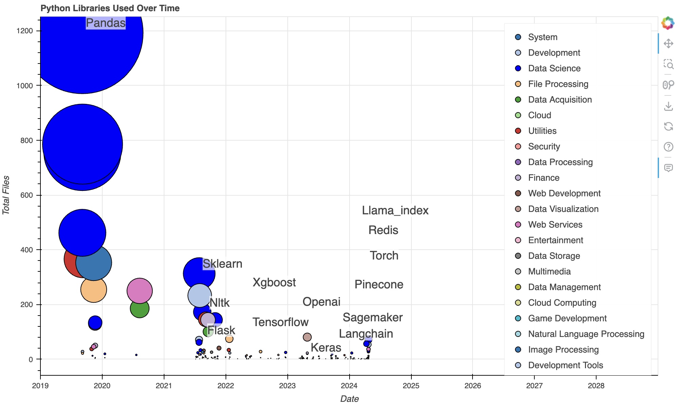

# Pythonic Journey: Analyzing Personal Python Library Usage

## Project Description
The Pythonic Journey project is a Python script that analyzes personal Python library usage across multiple directories and files. It crawls through specified directories, extracts metadata from Python (.py) and Jupyter Notebook (.ipynb) files, and generates a comprehensive report detailing the libraries used, their first usage dates, and the total number of files utilizing each library.

## Features
- Crawls through specified directories and subdirectories to find Python and Jupyter Notebook files.
- Extracts metadata from each file, including:
  - File path and name.
  - Creation date.
  - Packages/libraries used.
  - First usage date of each package.
  - Number of code cells (for Jupyter Notebooks).
  - Number of markdown cells (for Jupyter Notebooks).
  - Total lines of code.
- Aggregates metadata from all files and generates a summary report.
- Saves the report as a CSV file named `pythonic_journey.csv`.
- Provides an interactive visualization of the library usage over time using Bokeh.

## Requirements
- Python 3.x
- pandas
- bokeh

## Usage
1. Clone the repository or download the script files.
2. Install the required dependencies by running `pip install -r requirements.txt`.
3. Open the `pythonic_journey.py` file and modify the `directory_paths` list to include the directories you want to analyze.
4. Run the script using `python pythonic_journey.py`. The script will crawl through the specified directories, extract metadata, and generate the `pythonic_journey.csv` file.
5. Open the `library_usage_visualization.py` file and run it using `python library_usage_visualization.py`. The interactive visualization will be displayed in your default web browser.

## Visualization
The `library_usage_visualization.py` script provides an interactive visualization of the library usage over time. It uses the Bokeh library to create a scatter plot with the following features:
- X-axis represents the date of first usage for each library.
- Y-axis represents the total number of files utilizing each library.
- Bubble size corresponds to the scaled total number of files.
- Color coding based on the library category or label.
- Hover tool to display additional information about each library.
- Annotations for specific libraries of interest.
- Configurable legend with the ability to hide/show libraries by clicking on the legend items.

## Example Output
  
